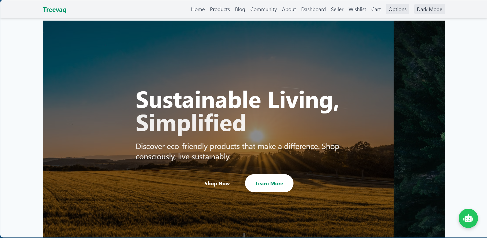

# Treevaq - Revolutionizing Sustainable E-Commerce Platform

Treevaq E-commerce Platform นวัตกรรมใหม่ที่ออกแบบมาเพื่อส่งเสริมการช้อปปิ้งอย่างยั่งยืน พัฒนาโดยใช้ Django และ Framework ต่างๆ รวมถึง Docker ที่จะเข้ามาช่วยเหลือในการพัฒนา Environment แพลตฟอร์มนี้เปิดโอกาสให้ผู้ใช้งานสามารถเลือกซื้อสินค้าที่เป็นมิตรกับสิ่งแวดล้อม ติดตามผลการลดการปล่อยคาร์บอน และจัดการประสบการณ์การช้อปปิ้งผ่านแดชบอร์ดที่ใช้งานง่าย โครงการนี้เน้นเรื่องจิตสำนึกด้านสิ่งแวดล้อม โดยผสานฟังก์ชันการใช้งานเข้ากับการใช้ชีวิตแบบรักษ์โลกได้อย่างลงตัว

สำหรับผู้ใช้งาน Treevaq มอบข้อมูลเชิงลึกที่ขับเคลื่อนด้วยข้อมูลจริงเกี่ยวกับผลกระทบต่อสิ่งแวดล้อมของตนเอง ช่วยให้สามารถตัดสินใจได้อย่างมีข้อมูล และติดตามการมีส่วนร่วมของตนต่อโลกที่เขียวขึ้น ไม่ว่าจะเป็นการเปลี่ยนมาใช้ผลิตภัณฑ์แบบไร้ขยะ หรือการสนับสนุนธุรกิจท้องถิ่นที่ยั่งยืน ผู้ใช้สามารถลงมือทำในสิ่งที่มีความหมาย โดยไม่ต้องลดทอนความสะดวกสบายหรือคุณภาพของสินค้า

Treevaq สนับสนุนเศรษฐกิจหมุนเวียน ส่งเสริมการบริโภคอย่างมีความรับผิดชอบ และสร้างชุมชนของผู้บริโภคที่ใส่ใจสิ่งแวดล้อมอย่างต่อเนื่อง ด้วยการขยายทางเลือกที่ยั่งยืน Treevaq มีบทบาทสำคัญในการรับมือกับปัญหาสภาพภูมิอากาศที่เร่งด่วน และสร้างโลกที่มีสุขภาพดีและยั่งยืนสำหรับคนรุ่นต่อไปในอนาคต

## 3.1 Abstract

Treevaq เป็นแพลตฟอร์มอีคอมเมิร์ซแบบเว็บไซต์ที่พัฒนาขึ้นโดยมีเป้าหมายเพื่อส่งเสริมการบริโภคอย่างยั่งยืน โดยเปิดโอกาสให้ทั้งผู้ซื้อและผู้ขายสามารถเข้าร่วมในตลาดที่เน้นการจำหน่ายผลิตภัณฑ์ที่เป็นมิตรต่อสิ่งแวดล้อม แพลตฟอร์มถูกพัฒนาโดยใช้ Django ซึ่งเป็นเฟรมเวิร์กสำหรับเว็บแอปพลิเคชัน พร้อมการสนับสนุนจาก RESTful API และ Docker เพื่อรองรับการพัฒนาอย่างมีประสิทธิภาพและขยายตัวในอนาคต

ผู้ใช้งานสามารถเลือกซื้อสินค้าสีเขียว เพิ่มลงในตะกร้า และติดตามผลกระทบเชิงสิ่งแวดล้อมจากพฤติกรรมการบริโภคของตนผ่านแดชบอร์ดที่ออกแบบมาให้ใช้งานง่าย Treevaq ยังมีระบบสำหรับผู้ดูแลที่สามารถติดตามยอดขาย พฤติกรรมผู้ใช้งาน และข้อมูลการลดการปล่อยคาร์บอนจากกิจกรรมต่าง ๆ บนแพลตฟอร์ม

### Treevap Project Concept

Treevaq ถูกออกแบบมาในฐานะ "ตลาดกลางออนไลน์สำหรับผลิตภัณฑ์ยั่งยืน" (Sustainable Marketplace) ที่ให้ความสำคัญกับการลดผลกระทบต่อสิ่งแวดล้อม โดยผู้ใช้งานสามารถลงทะเบียนเป็นผู้ซื้อหรือผู้ขาย และมีอิสระในการนำเสนอหรือเลือกซื้อผลิตภัณฑ์ที่ได้รับการคัดเลือกตามเกณฑ์ด้านสิ่งแวดล้อม

Treevaq ยังมีผลิตภัณฑ์ของตนเองที่พัฒนาขึ้นเพื่อตอบสนองต่อความต้องการของตลาดอย่างมีจริยธรรม อีกทั้งยังสนับสนุนแนวทางเศ
รษฐกิจหมุนเวียน (Circular Economy) โดยเน้นผลิตภัณฑ์ที่สามารถนำกลับมาใช้ใหม่หรือมีผลกระทบต่อสิ่งแวดล้อมน้อยที่สุด

### Key Features

Treevaq ได้รับการออกแบบให้รองรับการใช้งานที่หลากหลาย ทั้งในด้านประสบการณ์ผู้ใช้ การบริหารจัดการระบบ และการส่งเสริมการบริโภคอย่างยั่งยืน โดยมีคุณลักษณะสำคัญดังนี้:

- ระบบคัดเลือกผลิตภัณฑ์ที่เป็นมิตรกับสิ่งแวดล้อม: ทุกสินค้าที่วางจำหน่ายผ่านการประเมินตามเกณฑ์ด้านความยั่งยืน เช่น วัสดุที่ใช้ การผลิตที่ปลอดภัยต่อสิ่งแวดล้อม และการปล่อยคาร์บอนต่ำ
- แดชบอร์ดติดตามผลกระทบต่อสิ่งแวดล้อม: ผู้ใช้งานสามารถตรวจสอบข้อมูลเชิงลึกเกี่ยวกับการลดคาร์บอนที่เกิดจากการบริโภคสินค้าผ่านแพลตฟอร์ม พร้อมกราฟสถิติเพื่อเสริมสร้างความตระหนักรู้
- ระบบผู้ขาย (Seller Management System): รองรับการจัดการบัญชีผู้ขาย การอัปโหลดสินค้า การติดตามยอดขาย และการสื่อสารกับลูกค้า เพื่อส่งเสริมธุรกิจสีเขียวในระดับบุคคลและองค์กร
- ระบบบล็อกและข่าวสาร (Sustainability Blog): เผยแพร่บทความ ข่าวสาร และแนวทางการใช้ชีวิตอย่างยั่งยืนจากแหล่งข้อมูลที่เชื่อถือได้ เพื่อเสริมสร้างความรู้และความเข้าใจให้กับผู้ใช้งาน
- ระบบชุมชนรีวิวสินค้า (Community Review): เปิดพื้นที่ให้ผู้ใช้งานสามารถแสดงความคิดเห็นและรีวิวผลิตภัณฑ์อย่างเปิดเผย สร้างความน่าเชื่อถือและส่งเสริมความโปร่งใสของตลาดสีเขียว
- ระบบแชทบอทอัจฉริยะ (AI Chatbot System): ให้บริการช่วยเหลือตลอด 24 ชั่วโมงผ่านระบบ Chatbot ที่ขับเคลื่อนด้วยโมเดลภาษา (Language Model) สมัยใหม่ เช่น GPT หรือ LLaMA เพื่อรองรับคำถามทั่วไป แนะนำผลิตภัณฑ์ และให้ข้อมูลด้านความยั่งยืนอย่างแม่นยำ
- การขนส่งแบบยั่งยืน (Eco-friendly Delivery): รณรงค์ให้ผู้ขายเลือกใช้บริการขนส่งที่เป็นมิตรต่อสิ่งแวดล้อม เช่น รถไฟฟ้า การรวมรอบจัดส่ง และการลดการใช้บรรจุภัณฑ์เกินจำเป็น

## 3.2 User Stories (at least 3 usage scenarios)

1. **As a Shopper**
ผู้ใช้ทั่วไปสามารถเรียกดูรายการสินค้าเพื่อสิ่งแวดล้อม เลือกสินค้าที่ต้องการ และดำเนินการสั่งซื้อ พร้อมทั้งสามารถตรวจสอบคำสั่งซื้อย้อนหลังและจัดการรายการโปรดได้
   - ต้องการเลือกซื้อสินค้าสีเขียวอย่างสะดวก รวดเร็ว และปลอดภัย
   - ต้องการติดตามสถานะคำสั่งซื้อ ประวัติการสั่งซื้อ และดูข้อมูลด้านสิ่งแวดล้อมที่เกี่ยวข้อง
   - ต้องการบันทึกรายการโปรดหรือ Wishlist

2. **As an Administrator**
ผู้ดูแลระบบสามารถควบคุมดูแลการใช้งานของผู้ใช้ ระบบคำสั่งซื้อ และดูสถิติเชิงลึกเกี่ยวกับยอดขายและปริมาณคาร์บอนที่ลดลง
   - ต้องการเข้าถึงแดชบอร์ดที่แสดงสถิติแบบเรียลไทม์
   - ต้องการจัดการบัญชีผู้ใช้ เช่น การเปิด/ปิดบัญชีผู้ใช้
   - ต้องการควบคุมเนื้อหาบล็อกหรือโพสต์ที่อาจไม่เหมาะสม

3. **As a Content Creator**
ผู้สร้างเนื้อหาสามารถแบ่งปันข่าวสาร บทความ หรือรีวิวผลิตภัณฑ์ผ่านระบบ Blog และ Community ซึ่งเป็นช่องทางสร้างความร่วมมือในสังคมรักษ์โลก
   - ต้องการสร้างบทความเผยแพร่ความรู้ด้านความยั่งยืน
   - ต้องการรีวิวสินค้าหรือเขียนโพสต์ร่วมกับชุมชน
   - ต้องการสร้างพื้นที่พูดคุยระหว่างผู้บริโภคและผู้ขาย

4. **As a Seller**
ผู้ขายสามารถสร้างร้านค้าออนไลน์ที่ยั่งยืนโดยการอัปโหลดสินค้า แก้ไขข้อมูล และติดตามคำสั่งซื้อภายใต้แนวคิด Green Business
   - ต้องการเพิ่มสินค้าใหม่ในระบบ (เช่นผ่าน `/seller/add-product/`)
   - ต้องการติดตามยอดขายหรือปรับปรุงข้อมูลสินค้า
   - ต้องการสมัครเพื่อเป็นผู้ขายในระบบ

5. **As a General User with Questions**
ผู้ใช้สามารถโต้ตอบกับระบบแชทบอทอัจฉริยะเพื่อสอบถามเกี่ยวกับผลิตภัณฑ์ นโยบายแพลตฟอร์ม หรือแนวทางการบริโภคอย่างยั่งยืน
   - ต้องการรับคำแนะนำอัตโนมัติจาก Chatbot เช่นที่ `/api/chatbot/`
   - ต้องการสอบถามขั้นตอนการซื้อขายหรือนโยบายสิ่งแวดล้อม

## 3.3 Usage Procedures Based on User Stories

### For Shoppers

1. เข้าสู่ระบบผ่านหน้า Home (`/`) หรือ Signup (`/signup/`)
2. เรียกดูสินค้าผ่านหน้า Product List (`/products/`)
3. คลิกที่สินค้าเพื่อดูรายละเอียด (`/product/<id>/`) และเลือก "เพิ่มลงตะกร้า" (`/add-to-cart/<id>/`)
4. ตรวจสอบสินค้าในตะกร้าผ่าน (`/cart/`) และชำระเงินผ่านหน้า `/checkout/`
5. ตรวจสอบสถานะคำสั่งซื้อ (`/order-history/`) และดูรายละเอียดคำสั่งซื้อรายรายการ (`/order/<id>/`)
6. สามารถเพิ่มสินค้าที่ชื่นชอบลง Wishlist (`/wishlist/`) และจัดการผ่าน `add-to-wishlist/`, `remove-from-wishlist/`

### For Administrators

1. เข้าสู่ระบบผ่านแดชบอร์ดผู้ดูแลระบบ (`/dashboard/`)
2. ตรวจสอบข้อมูล: จำนวนสินค้า คำสั่งซื้อ รายได้ และคาร์บอนที่ลดได้
3. จัดการบัญชีผู้ใช้ผ่าน `/user-management/`, `/edit-user/<id>/`, `/deactivate-user/<id>/`
4. ตรวจสอบยอดขายและสินค้าขายดีจากแดชบอร์ดหรือฐานข้อมูล

### For Content Creators

1. เข้าสู่ระบบด้วยสิทธิ์ที่ได้รับ (หรือ Google OAuth หากมีการเชื่อมต่อ)
2. เข้าสู่ระบบ Blog (`/blog/`) หรือ Community (`/community/`) เพื่ออ่านหรือเพิ่มเนื้อหา
3. คลิก "เพิ่มบทความ" หรือ "เพิ่มโพสต์" เพื่อสร้างคอนเทนต์
4. ตรวจสอบโพสต์ที่เผยแพร่ผ่าน URL เช่น `/blog/<id>/` หรือระบบ API เช่น `/api/community/posts/`
5. สามารถลบ/แก้ไขความคิดเห็นได้ตามสิทธิ์ผ่าน API ที่กำหนดไว้

### For Sellers

1. สมัครเป็นผู้ขายผ่านหน้า `/seller/apply/`
2. เพิ่มสินค้าใหม่ผ่าน `/seller/add-product/`
3. แก้ไขหรือจัดการสินค้าผ่าน `/seller/edit-product/<id>/` และ `/seller/delete-product/<id>/`
4. ติดตามยอดขายหรือคำสั่งซื้อผ่านแดชบอร์ดส่วนผู้ขาย

### For General Users Using Chatbot

1. เปิดการสนทนาผ่าน chatbot ที่เชื่อมกับ API `/api/chatbot/`
2. พิมพ์คำถามเกี่ยวกับสินค้า การจัดส่ง หรือแนวทางการรักษ์โลก
3. รับคำแนะนำอัตโนมัติจากระบบ AI เช่น GPT2 (Demon)

## 3.4 Installation and Usage Instructions

### Prerequisites (⚠️ Important)

สิ่งที่ผู้ใช้งานต้องเตรียมก่อน git clone สำหรับในเบื้องต้นมีดังต่อไปนี้ (หากติดตั้งไว้แล้ว สามารถข้ามผ่านได้)

1. **`C++ build tools`** 
   - for Windows OS โดยสามารถติดตั้งแต่ได้ผ่าน
      - https://visualstudio.microsoft.com/visual-cpp-build-tools/ และ คลิก "Download Build Tools"
      - เมื่อเข้าสู่หน้า Visual Studio Installer คลิกเลือก "Desktop development with C++" และ "C++ Tools for Linux Development (optional)"
      - มั่นใจว่ามีการเลือก
         - MSVC v14.x (Latest) - VS 2019/2022 C++ x64/x86 build tools
         - Windows 10 SDK (หรือ Windows 11 SDK หากคุณใช้ Windows 11) 
   - for Linux OS (optional)
      - บน Debian/Ubuntu:
      ```bash
      sudo apt update
      sudo apt install build-essential python3-dev
      ```
      - บน CentOS/RHEL/Fedora:
      ```bash
      sudo dnf groupinstall "Development Tools" 
      sudo dnf install python3-devel
      ```
      - บน Arch Linux:
      ```bash
      sudo pacman -S base-devel python
      ```
2. **`.env`** ไฟล์
   - โดยคุณจำเป็นต้องเตรียม keys สำหรับสร้างไฟล์นี้และเก็บตัวแปรดังต่อไปนี้
      - SOCIAL_AUTH_GOOGLE_OAUTH2_KEY=  (Client ID)
      - SOCIAL_AUTH_GOOGLE_OAUTH2_SECRET= (Client secret)
   - คุณสามารถนำ keys เหล่านี้จาก Google Cloud Platform ในหัวข้อ APIs & Services -> Credentials -> Clients มาใช้งานได้ 
   
   - keys ของผู้พัฒนา (สามารถนำไปใช้ได้ (หากดูบน Github จะไม่สามารถเห็นคีย์นี้ได้))

      -**`SOCIAL_AUTH_GOOGLE_OAUTH2_KEY=xxxxxxxxxxxxxxxxxxx`**

      -**`SOCIAL_AUTH_GOOGLE_OAUTH2_SECRET=xxxxxxxxxxxxxxxxxxx`**

เหตุผล: 
   - `C++ build Tools`: เนื่องจากระบบ Promptpay QR code มีการใช้ package "crc16" ซึ่งต้องการ C++ compiler (Microsoft Visual C++ Build Tools) เพื่อ build wheel จาก source code
   - `.env`: เนื่องจากไม่สามารถทางผู้พัฒนาไม่สามารถอัพ keys ที่เป็น secret ต่างๆขึ้น github ได้จึงจำเป็นต้องให้ผู้ใช้เตรียมไว้ในเบื้องต้น 

### Installation Steps (Docker-Based)

1. **Clone the Repository**:

   ```bash
   git clone https://github.com/ftkbyond77/dsi202_2025.git
   cd dsi202_2025
   ```

2. **Create .env files and add keys**:

   ```bash
   echo "SOCIAL_AUTH_GOOGLE_OAUTH2_KEY=xxxxxxxxxxxxxxxxxxx" > .env

   echo "SOCIAL_AUTH_GOOGLE_OAUTH2_SECRET=xxxxxxxxxxxxxxxxxxx" >> .env
   ```
   ⚠️*warning:* keys ของผู้พัฒนา (สามารถนำไปใช้ได้ (หากดูบน Github จะไม่สามารถเห็นคีย์นี้ได้)) วางไว้ในตำแหน่งเดียวกับ Dockerfile เพื่อไม่ให้เกิดปัญหา

3. **Build the Application**:

   ```bash
   docker-compose build
   ```
   ⚠️ *Warning:* ในขั้นตอนนี้อาจใช้เวลานานในครั้งแรก! (เครื่องทดสอบอยู่ที่ประมาณ 10 นาที +-) เนื่องจากต้องมีการติดตั้ง torch และ transformers พร้อมกับ load cache สำหรับ chatbot model

4. **Start the Application**:

    ```bash
   docker-compose up
   ```

5. **Stop the Application**:

    ```bash
   docker-compose down
   ```

### Usage Instructions

- **Access the Application**: เปิดเบราว์เซอร์ของคุณและไปที่ `http://localhost:8000/`
- **Log In**: สามารถใช้ username: "john" และ password: "cena" เพื่อเข้าถึงแผงควบคุมแอดมินได้ (`/admin/`) หรือสามารถ login ผ่านบัญชี Google
- **Explore Features**: ไปที่ `/products/` เพื่อช็อปปิ้ง `/dashboard/` สำหรับงานผู้ดูแลระบบ รวมถึง `/blog/` สำหรับบทความ และระบบอื่นๆ
- **Admin Management**: ล็อกอินที่ `/admin/` เพื่อจัดการระบบหลังบ้าน
- **API Access**: ใช้  `/api/products/` เพื่อโต้ตอบกับรายการสินค้าผ่าน REST API (ต้องการการยืนยันตัวตนสำหรับการดำเนินการเขียน) คุณสามารถดูไฟล์ app1/urls.py เพื่อดูว่ามี api อะไรบ้าง

### Additional Notes

- ตรวจสอบการตั้งค่า media ที่ถูกต้องใน `settings.py` (`MEDIA_URL` และ `MEDIA_ROOT`) หากมีการอัปโหลดรูปภาพ
- ปรับแต่งเทมเพลตหรือโมเดลใน `app1/` ตามความต้องการเฉพาะของคุณ
- การเตรียม environment หรือ dependency เป็นสิ่งที่สำคัญมากในขั้นตอนก่อน build 

### System Notes

- เป็นระบบ e-commerce ในระดับเบื้องต้นหรือ demo เท่านั้น ยังไม่เสร็จสมบูรณ์และพร้อมใช้งาน 100%
- ระบบนี้อาจใช้ทรัพยากรสูงหรือมีการสร้าง container ขึ้นที่อาจใช้ทรัพยากรในระดับนึง เนื่องจากมีการเรียกใช้โมเดล openai/community/chatgpt2 มาใช้งาน ซึ่งเป็นจุดที่ผู้พัฒนาอยากเน้นย้ำ เนื่องจากในขั้นตอน docker-compose build อาจใช้เวลาสักพัก
- ระบบ payment ยังคงเป็นแบบ manual ที่ต้องปรับสถานะที่หลังบ้าน เนื่องจากข้อจำกัดด้านการเงินและทรัพยากร

This README provides a comprehensive guide to get started with Treevaq, supporting its sustainable e-commerce vision.




**ผู้เขียน:** นายชยุต มีคุณ 6624650195, วิทยาลัยสหวิทยาการ สาขาวิทยาศาสตร์และนวัตกรรมข้อมูล มหาวิทยาลัยธรรมศาสตร์
© 2025
